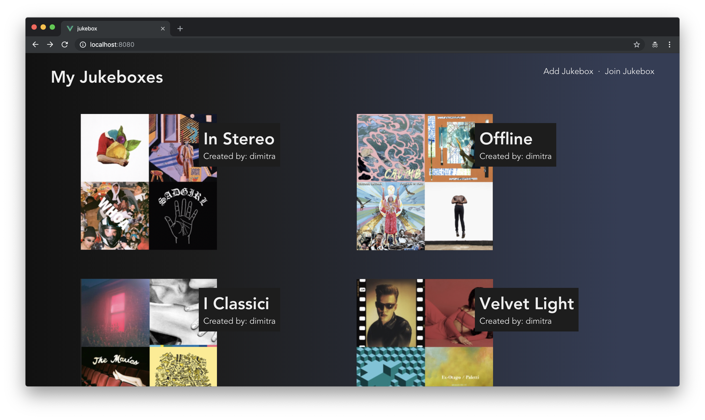
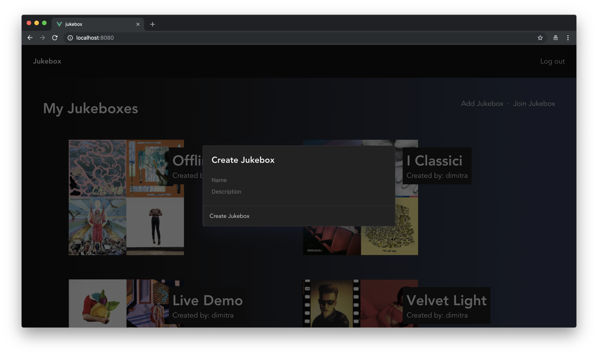
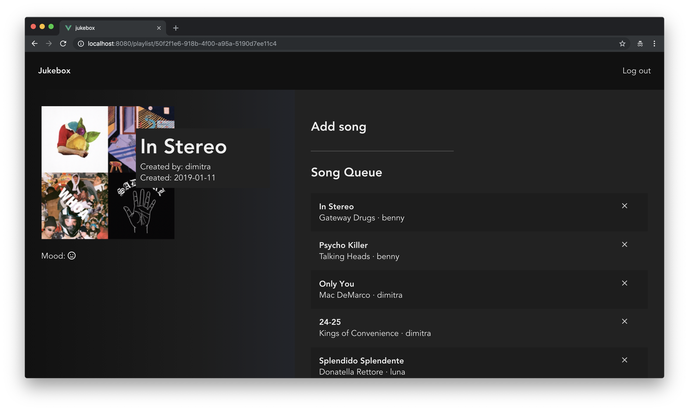

# Jukebox

Jukebox is a Vue.js app built with AWS AppSync and Amplify, to demonstrate real-time collaborative app use cases. [`Vue Apollo`](https://github.com/Akryum/vue-apollo) is used for GraphQL queries. 

The idea of the application is to allow users to collaborate to a single playlist at social events from multiple devices, without having to pass around a single device. 
It allows users to:
* Sign up or log in to the application using Cognito User Pools
* Create jukeboxes (playlists)
* Join a jukebox by its `ID`, to start collaborating to another user's jukebox
* Add songs to the jukebox in real time. Any songs that are added to a jukebox should be synchronised to each instance of the Jukebox application immediately

Additionally,
* Any songs that are added to the jukebox when the user is offline are uploaded when the user comes back online
* A jukebox’s mood will is detected and displayed to the user, using Amazon Comprehend’s Natural Language Processing (NLP) from the combination of all the song lyrics in the entire playlist.



## Natural Language Processing
The mood for the playlist is updated as new songs are added, and is calculated based on the combination of lyrics from all songs in the playlist. This is done using a Lambda function, exposed using API gateway.

```python
import os, boto3, json

client = boto3.client('comprehend')

def respond(err, res=None):
    return {
        'statusCode': '400' if err else '200',
        'body': err.message if err else json.dumps(res),
        'headers': {
            'Content-Type': 'application/json',
        },
    }
    
def lambda_handler(event, context):
    sentiment = client.detect_sentiment(Text=event['lyrics'], LanguageCode='en')['Sentiment']
    return sentiment
```


## Design
Create a new jukebox:


Add new songs:


## Additional info
This app was developed as part of a practical term paper for my Cloud Computing module. The paper can be found [here](./assets/term_paper.pdf). 
